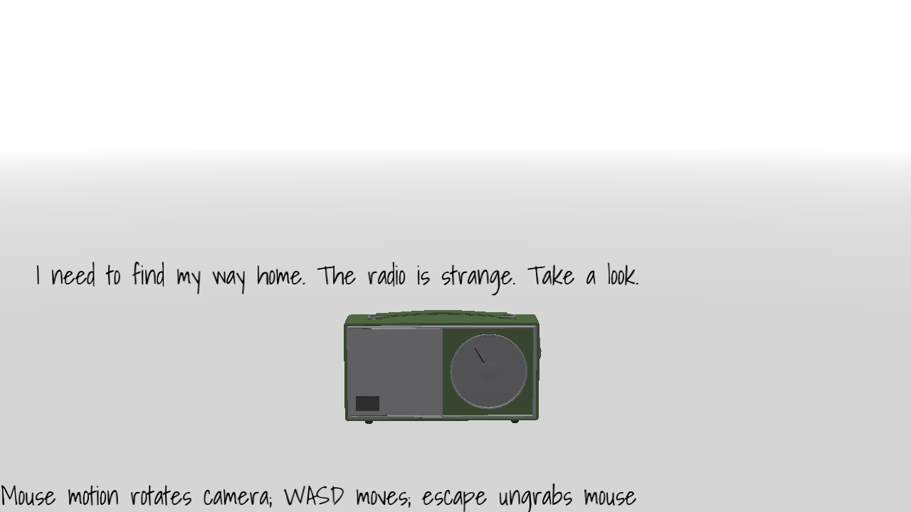

# Realtime Text Rendering

Author: Harrison Chen

Design: It is really hard to come up with a meaningful plot. I just implemented the realtime
text rendering engine who render text one-the-fly with a cache.

Text Drawing: It render text on-the-fly, handles ligatures with Harfbuzz and render bitmap with
Freetype. It uses a cache to boost performance in case of massive text rendering.

Screen Shot:

How To Play:

(TODO: describe the controls and (if needed) goals/strategy.)

Sources: 
- [Shadows Into Light](https://fonts.google.com/specimen/Shadows+Into+Light?query=shadows) font is designed by Kimberly Geswein, released under [Open Font License](https://scripts.sil.org/cms/scripts/page.php?site_id=nrsi&id=OFL)

This game was built with [NEST](NEST.md).

